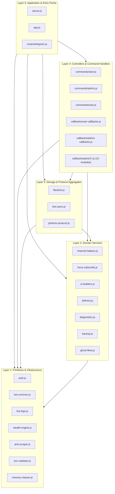

# Module Dependency Graph

This document details the architectural module dependency graph for the Telegram File Store Bot, organized into a strict 5-layer directed acyclic graph (DAG).

## Layer Hierarchy Overview

---

## Architectural Principles & Rules

1. **Strict Upward/Downward Layering**:
   - Lower layers **never** import higher layers.
   - Cross-module communication between peers within the same layer is minimized and strictly acyclic.

2. **Decoupling Key Cycles**:
   - **`auth.js` vs `bot-users.js`**: `getAdminIds`, `getAdminId`, `isAdmin`, and `resetAdminCache` reside in `auth.js` (Layer 1). `bot-users.js` (Layer 3) imports and re-exports them for backward compatibility without creating an inverse cycle back to `channel-helpers.js`.
   - **`bot-common.js` Primitives**: Low-level Telegram API primitives (`copyMessage`, `forwardMessage`) reside in `bot-common.js` (Layer 1), allowing `ghost-fleet.js` (Layer 2) and `delivery.js` (Layer 2) to reference them without mutual dependency.
   - **Phoenix Protocol Hook**: `phoenix-protocol.js` (Layer 3) registers its failover callback with `channel-helpers.js` (Layer 2) via `registerChannelFailoverHandler(activatePhoenixProtocol)`. This eliminates the need for `channel-helpers.js` to statically or dynamically import `phoenix-protocol.js`.
   - **Delivery & Channel Helpers**: `delivery.js` imports channel resolution from `channel-helpers.js`; `filestore.js` imports storage-copying functions from `delivery.js` and existence checks from `channel-helpers.js`.

3. **100% Static Module Imports**:
   - All runtime dynamic `await import(...)` calls have been eliminated.
   - The module graph is fully statically resolvable at compile/boot time, ensuring predictable startup performance and eliminating hidden runtime import errors.
